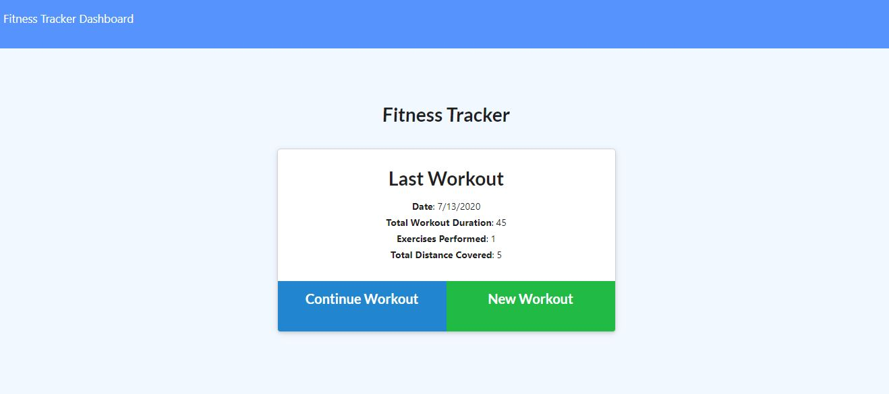
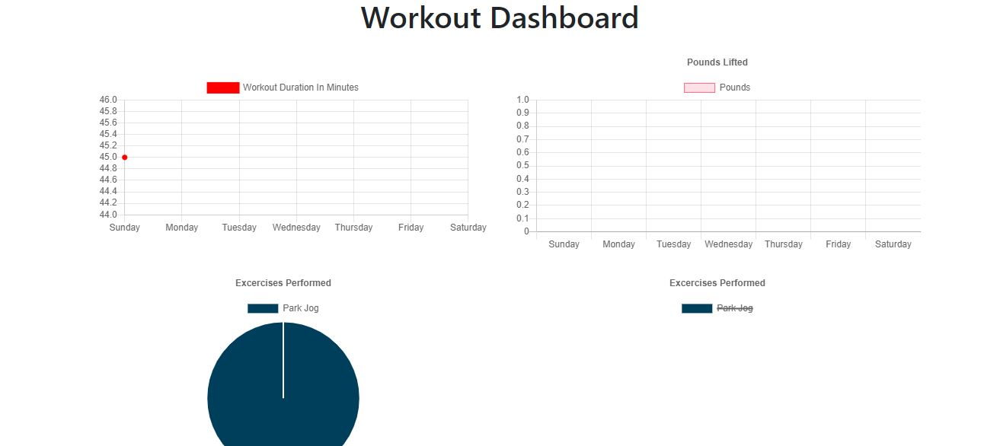
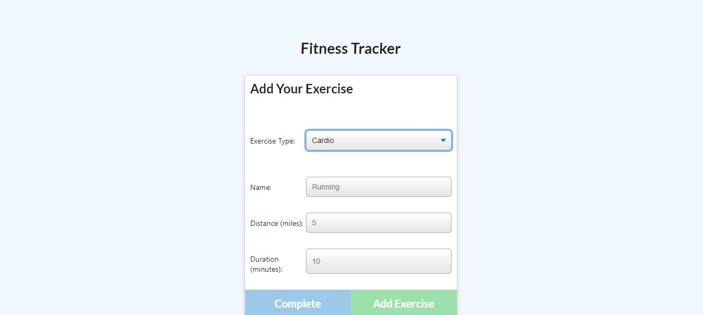

# Fitness Tracker

## Description

As a user, I want to be able to view create and track daily workouts. I want to be able to log multiple exercises in a workout on a given day. I should also be able to track the name, type, weight, sets, reps, and duration of exercise. If the exercise is a cardio exercise, I should be able to track my distance traveled.

This assignment required me to create Mongo database with a Mongoose schema and handle routes with Express.

When the user loads the page, they should be given the option to create a new workout, or continue with their last workout.

The user should be able to:

  * Add exercises to a previous workout plan.

  * Add new exercises to a new workout plan.

  * View multiple the combined weight of multiple exercises on the `stats` page.

## Table of Contents
* [Usage](#usage)
* [Finished Product](#finished-product)
* [Technologies](#technologies)
* [Future Development](#future-development)
* [Questions](#questions)

## Usage
Run "npm i" in your terminal, and once it has finished installing, run "npm install mongoose"

## Finished Product
View the deployed Heroku app here: https://fitness-tracker-ausley.herokuapp.com/?id=5f0d18863b35140017e490c4 

Take a look:

## Technologies
HTML
CSS
JavaScript
Node.js
Express.js
MongoDB
Mongoose
Chart.js

## Future Development
In the coming weeks, I'd really like to work on the styling of this webpage. Both the medium of the pages and the charts don't look quite as nice as I'd like them to with more sophisticated styling. With time, this will come! 

## Questions
​
If you have any questions about the repo, please contact me:

On GitHub: [cmausley](https://github.com/cmausley) | Via Email: christinamausley@gmail.com